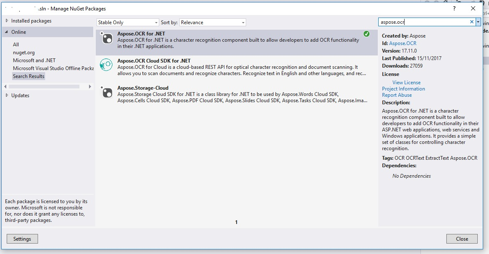
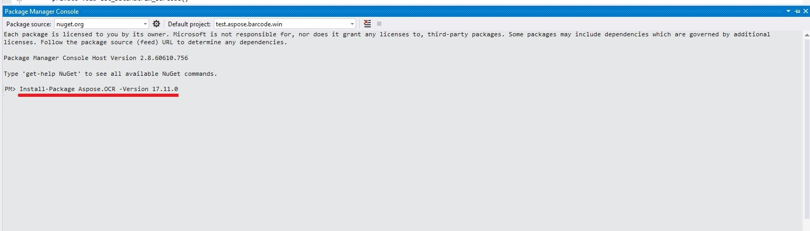
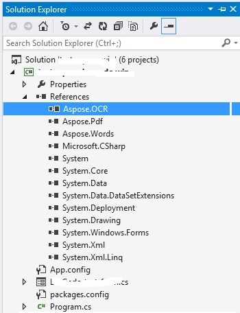

## **Installing Aspose.OCR for .NET through NuGet**
NuGet is the easiest way to download and install Aspose .NET APIs. **Open** Microsoft Visual Studio. Select **TOOLS** menu, goto **NuGet Package Manager** and select **Manage NuGet packages for solution**. Search 'aspose.ocr' keyword. This will find the desired Aspose API. Click on "Install" button, the selected API will be downloaded and referenced in your project.

## **Install or Update Aspose.OCR using the Package Manager Console**
You can follow the steps below to install or upgrad the Aspose.OCR API using the package manager console:
Open your solution/project in Visual Studio.
Select **TOOLS** -> **NuGet Package Manager** -> **Package Manager Console** from the top menu. This will open package manager console.

Type the command “Install-Package Aspose.OCR -Version x.x.0” and press enter to install latest full release into your application. Alternatively, you can add the "-prerelease" suffix to the command in order to specify that the latest release including hot fixes is to be installed as well.

If you are not familiar with the Aspose EULA <http://www.aspose.com/corporate/purchase/end-user-license-agreement.aspx> then it is a good idea to read the license referenced in the URL. 
You should now find that Aspose.OCR has successfully been added and referenced in your application for you.

In the package manager console, you can use the command **Update-Package Aspose.OCR.NET** and press enter to check for any updates to the Aspose.OCR package and install them if present. You can also add the "-prerelease" suffix to update latest release.
## **Referencing the Component**
To use any component in your application, you must add a reference to it. The following steps assume that you use Visual Studio .NET.

1. In Solution Explorer, expand the project node you want to add a reference to.
1. Right-click the project's References node and select **Add Reference** from the menu.
1. In the **Add Reference** dialog, select the **.NET** tab (selected by default).
1. If you have used an MSI installer to install Aspose.OCR, Aspose.OCR is listed in the top pane. Select Aspose.OCR and then click **Select**.
1. If you have downloaded and unpacked the DLL only, locate the Aspose.OCR.dll file using the **Browse** button. Now that you have referenced Aspose.OCR and it should appear in the Selected Components pane of the dialog box.
1. Click **OK**.

The Aspose.OCR reference appears under the project's References node.
## **Uninstalling Aspose.OCR for .NET**
If you have used an MSI installer to deploy Aspose.OCR, follow these steps to completely remove the component and the associated demos and documentation:

1. From the **Start** menu, select **Settings** | **Control Panel**.
1. Click **Add/Remove Programs**.
1. Select **Aspose.OCR**.
1. Click the **Change/Remove** button to remove Aspose.OCR.

The component is un-installed.
