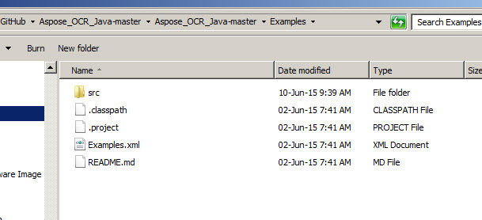
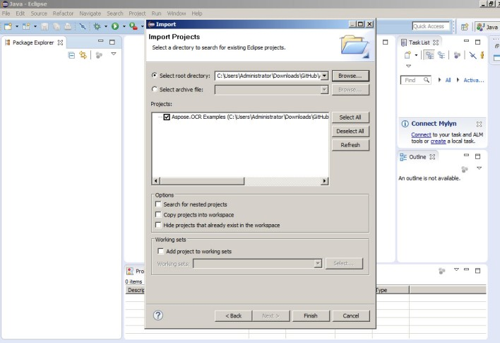
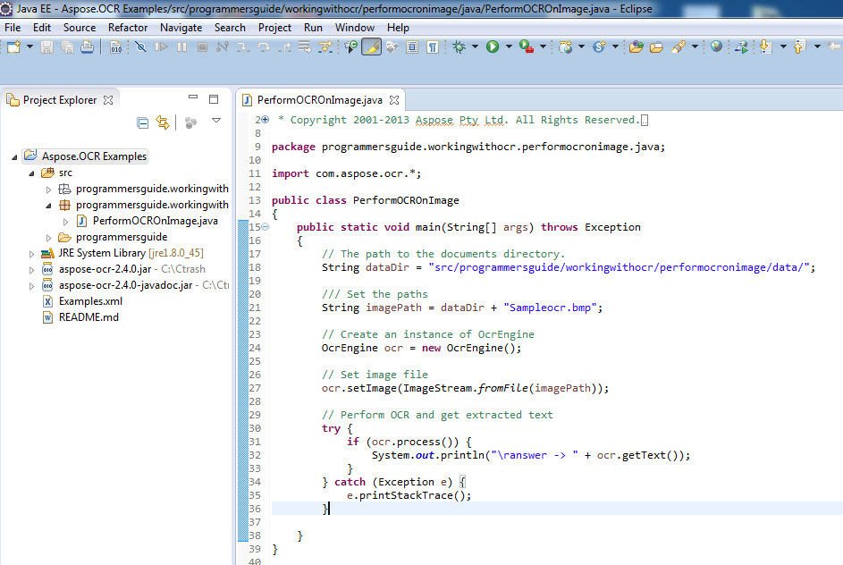
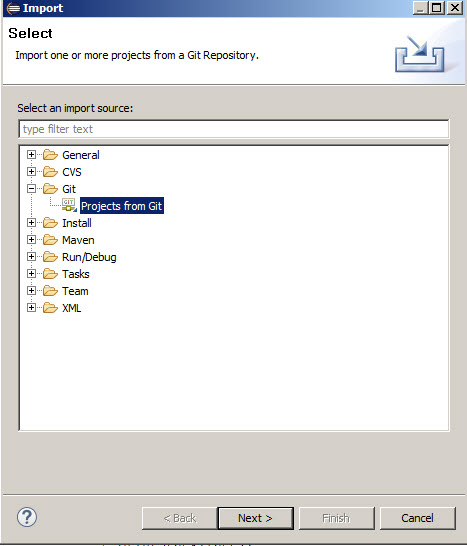
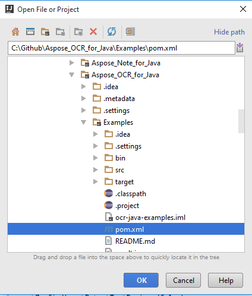
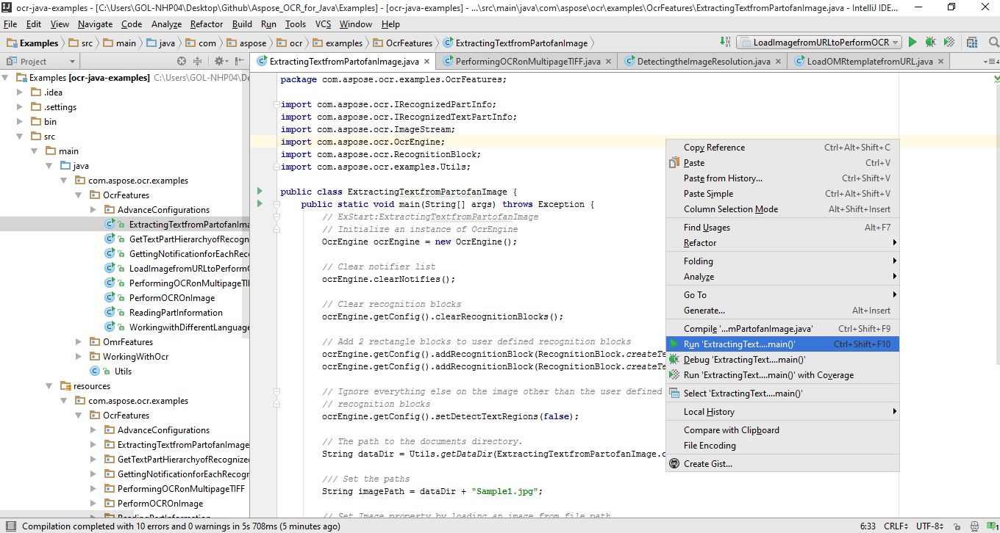
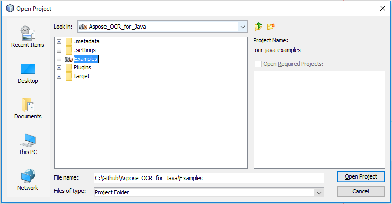
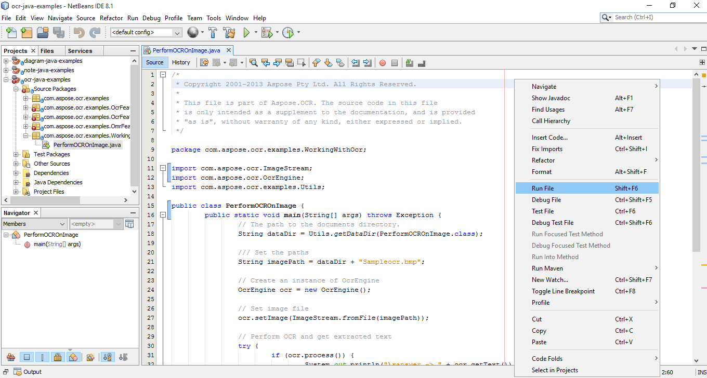

### **Download from GitHub**
All of the Aspose.OCR for Java examples are hosted on [Github](https://github.com/aspose-ocr/Aspose.OCR-for-Java). You can either clone the repository using Github client or download the ZIP file from [here](https://github.com/aspose-ocr/Aspose.OCR-for-Java/archive/master.zip).

Extract the contents of ZIP file on your computer. You will find the **Examples** folder. All the examples are located in the **Examples** folder.

You can run/execute these examples with any IDE of you choice, however, for demonstration purposes, we are using **Eclipse**. Use the **File -> Import** option to import the example of your choice and specify the path.

Add the required jar files (Libraries) in the project.

The **Data** folder contains input documents/files referred in the example.

{} 

You can also import the examples directly from GitHub repository.

{} 

### **IntelliJ IDEA**
Click on the **File** menu and choose **Open**. Browse to the project folder and select the **pom.xml** file.

It will open the project and download the dependencies automatically. From the Project tab, browse the examples in **src/main/java** folder. To run an example, just right click on the file and choose "Run ..", the example will be executed and the output will be shown in the built in console output window.

### **NetBeans**
Click on the **File** menu and choose **Open Project**. Browse to the folder that you cloned or downloaded from GitHub. The icon of **Examples** folder will show that its a Maven project. Select Examples and open it.

It will open the project and download the dependencies automatically. From the Projects tab, browse the examples in **source packages**. To run an example, just right click on the file and choose **Run File**, the example will be executed and the output will be shown in the built in console output window.

### **Contribute**
If you like to add or improve an example, we encourage you to contribute to the project. All examples and showcase projects in this repository are open source and can be freely used in your own applications.

To contribute, you can fork the repository, edit the source code and create a pull request. We will review the changes and include it in the repository if found helpful.
