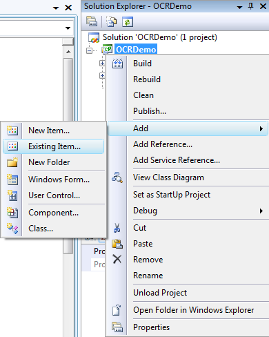
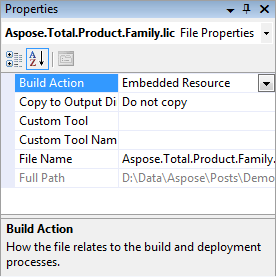

## **Applying a License**
You can easily download an evaluation version of Aspose.OCR for .NET from the [download page](https://downloads.aspose.com/ocr/net). The evaluation version provides the same features as the licensed version with some limitations. When you purchase a license, all you have to do is to apply the license by adding a couple of source code lines to your application.
### **Evaluation Version Limitation**
The evaluation version of Aspose.OCR for .NET limits the number of characters extracted from an image to 300.
### **Applying a License to Aspose.OCR for .NET**
Here are some details about Aspose licenses:

- The license is a plain-text XML file that contains details such as the product name, the number of developers it is licensed for, the subscription expiry date and so on. The file is digitally signed, so don't modify it. Even adding an extra line break will invalidate the license.
- You need to apply a license before starting the character recognition process, whereas the license is applied once per application life cycle (or process).
- The license can be loaded from a file, stream or an embedded resource.

Aspose.OCR for .NET tries to find the license in the following locations:

- Explicit path: The folder that contains Aspose.OCR.dll 
- The folder that contains the assembly that called Aspose.OCR.dll
- The folder that contains the entry assembly (your .exe)
- An embedded resource in the assembly that called Aspose.OCR.dll
### **Applying a License Using a File or a Stream**
The easiest way to set a license is to put the license file in the same folder as that of Aspose.OCR.dll and specify the file name, not the path.

**C#**



 // Instantiate an instance of license and set the license file through its path

Aspose.OCR.License license = new Aspose.OCR.License();

license.SetLicense("Aspose.OCR.lic");



When you call the SetLicense method, the license name should be same as that of your license file name. For example, you may change the license file name to "Aspose.OCR.lic.xml". Then in your code, you should use the modified license name (that is Aspose.OCR.lic.xml) for the SetLicense method.It is also possible to load a license from a stream.

**C#**



 //Instantiate an instance of license and set the license through a stream

Aspose.OCR.License license = new Aspose.OCR.License();

license.SetLicense(myStream);



#### **Applying a License Using an Embedded Resource**
Another neat way of packaging the license with your application and making sure it will not be lost, is to include it as an embedded resource into one of the assemblies that calls Aspose.OCR. To include the license file as an embedded resource:

In Visual Studio .NET, include the license file (.lic) in the project using the **File** | **Add Existing Item...** menu option. 

Select the file in the Solution Explorer and set **Build Action** to **Embedded Resource** in the **Properties** window 

To access the license embedded in the assembly (as an embedded resource), it is not necessary to call the GetExecutingAssembly and GetManifestResourceStream methods of the System.Reflection.Assembly class of the Microsoft .NET Framework. Instead, just add the license file as an embedded resource to your project and pass the name of the license file into the SetLicense method. The License class will automatically find the license file in the embedded resources.The example below illustrates how to embed a license in your applications.

**C#**



 // Instantiate the License class

Aspose.OCR.License license = new Aspose.OCR.License();

//Pass only the name of the embedded license file

license.SetLicense("Aspose.OCR.lic");


### **Setting a License in the Source Code**
The license needs to be applied only once per application or process. For desktop applications, we recommend that you set the license in the Initialize() method of the main form. For web applications, set it in the global.asax file’s Session_Start() method.
